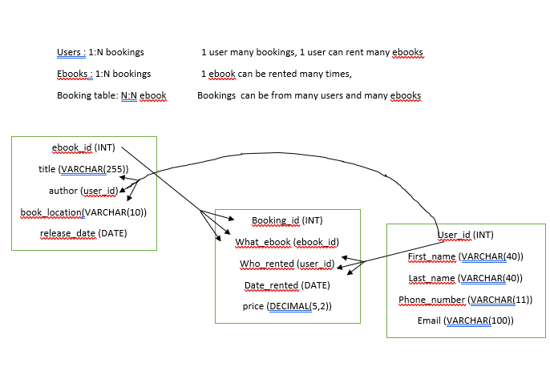

# Assignment - Startup bookstore
## ERD Diagram for the Task



### Create Database
First Create your database for the task
```sql
CREATE DATABASE bookstore_matt;
```

### Create Tables
Create the necessary tables for the task
```sql
USE bookstore_matt;

CREATE TABLE users(
    user_id INT NOT NULL IDENTITY(1,1) PRIMARY KEY,
    first_name VARCHAR(40) NOT NULL,
    last_name VARCHAR(40) NOT NULL,
    phone_number VARCHAR(11) NOT NULL,
    email VARCHAR(100) NOT NULL
);

CREATE TABLE ebooks(
    ebook_id INT NOT NULL IDENTITY(1,1) PRIMARY KEY,
    title VARCHAR(255) NOT NULL,
    author INT REFERENCES users(user_id),
    book_location VARCHAR(10) NOT NULL,
    release_date DATE NOT NULL
);

CREATE TABLE booking(
    booking_id INT NOT NULL IDENTITY(1,1) PRIMARY KEY,
    what_ebook INT REFERENCES ebooks(ebook_id),
    who_rented INT REFERENCES users(user_id),
    date_rented DATE,
    price DECIMAL(5,2)
);
```
### Test Data
- In order to determine whether we successfully created the necessary tables, input some values for users, ebooks and bookings:

```sql
INSERT INTO users(
    first_name,
    last_name,
    phone_number,
    email
) VALUES (
    'Charlie',
    'Smithers',
    '07637294747',
    'charlie.smithers@Hotwail.com'
);

INSERT INTO users(
    first_name,
    last_name,
    phone_number,
    email
) VALUES (
    'Tommy',
    'Shelby',
    '0173666422',
    'tommy.shelby@peaky.com'
);

INSERT INTO users(
    first_name,
    last_name,
    phone_number,
    email
) VALUES (
    'Kirsty',
    'Manuel',
    '07363626161',
    'kirsty.manuel@hiya.com'
);

INSERT INTO users(
    first_name,
    last_name,
    phone_number,
    email
) VALUES (
    'Billy',
    'Butcher',
    '0555123231',
    'billy.butcher@cant.com'
);

INSERT INTO ebooks(
    title,
    author,
    book_location,
    release_date
) VALUES (
    'The Wild Adventures of Timmy',
    1,
    '21c',
    '20200813'
);

INSERT INTO ebooks(
    title,
    author,
    book_location,
    release_date
) VALUES (
    'Pine Away stories',
    2,
    '61a',
    '20190717'
);

INSERT INTO ebooks(
    title,
    author,
    book_location,
    release_date
) VALUES (
    'Reflection Nightmares',
    4,
    '151g',
    '20010812'
);

INSERT INTO ebooks(
    title,
    author,
    book_location,
    release_date
) VALUES (
    'The Maynard Lores',
    3,
    '19b',
    '20200130'
);

INSERT INTO booking (
    what_ebook,
    who_rented,
    date_rented,
    price
) VALUES (
    3,
    1,
    '20200530',
    5.99
);

INSERT INTO booking (
    what_ebook,
    who_rented,
    date_rented,
    price
) VALUES (
    1,
    3,
    '20200312',
    6.99
);

INSERT INTO booking (
    what_ebook,
    who_rented,
    date_rented,
    price
) VALUES (
    2,
    2,
    '20190930',
    10.99
);
```
### Results
- To visualise the data inputted, run the below commands, for simple output simply do the first 3 lines and for a more complex ouput
where each key is its individual string do the other `INNER JOIN` code

```sql
SELECT * FROM users;
SELECT * FROM ebooks;
SELECT * FROM booking;

-- The below code will output the data nicely into a table with all the id as
-- their respectable names instead of integers

SELECT
    booking.booking_id,
    users.first_name,
    users.last_name,
    ebooks.title,
    booking.date_rented,
    booking.price
FROM booking
INNER JOIN users ON booking.who_rented = users.user_id
INNER JOIN ebooks ON booking.what_ebook = ebooks.ebook_id;
```
### Simple Output


### Complex (prettier) Output


